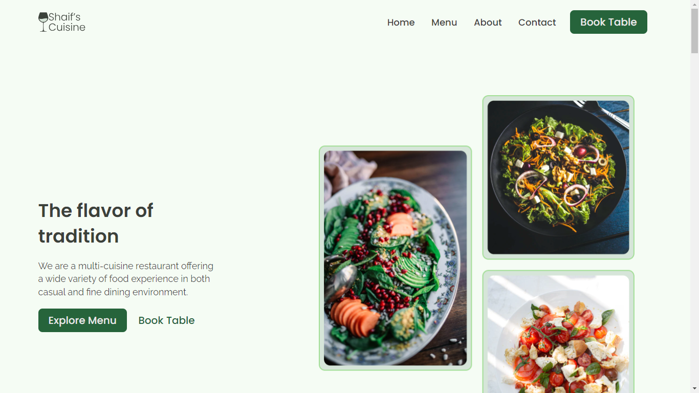

# Shaif's Cuisine 👨‍🍳

Este projeto visa replicar exatamente o design e a funcionalidade do site original Shaif's Cuisine um site para restaurantes. Ele apresenta um layout moderno e elegante, com uma navegação intuitiva e elementos interativos que melhoram a experiência do usuário. O site é totalmente responsivo, garantindo que os usuários tenham uma experiência consistente em dispositivos de diferentes tamanhos.

## Conhecimentos abordados

- HTML, CSS
- javaScript DOM
- CSS Grid
- Scroll Animation
- Responsivity
- Netfly Deployment
- Outros ...

## Licença

[MIT](https://choosealicense.com/licenses/mit/)

## Créditos
 - `web cifar community`